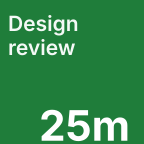
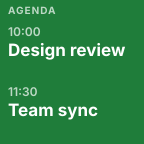

# Next Meeting for Stream Deck


See how long you have until your next Google Calendar meeting, then join it from your Stream Deck with one press. Next Meeting keeps the essential details close at hand without sending your calendar data through a separate service.

## Features

- Countdown key for the next eligible meeting.
- One-press joining for Google Meet, Zoom, Microsoft Teams, Webex, and other detected meeting links.
- Agenda Dial for browsing and joining today's upcoming meetings on Stream Deck +.
- Multiple Google accounts, blended into one agenda with duplicate events removed.
- Read-only Google Calendar access; the plugin cannot create, edit, or delete events.
- Local OAuth 2.0 with PKCE. Calendar data and tokens stay on your computer.

## Installation

### Stream Deck Marketplace

1. Open the Stream Deck application.
2. Open the Marketplace and search for **Next Meeting**.
3. Select **Install**.
4. Drag the **Next Meeting** action onto a key. On Stream Deck +, drag **Agenda Dial** onto an encoder.

### Install a release package

1. Download the `Next Meeting.streamDeckPlugin` release package.
2. Open the package to install it in the Stream Deck application.
3. Add the action to your profile as described above.

## Requirements

- Stream Deck application 6.5 or later.
- macOS 12 or later, or Windows 10 or later.
- A Stream Deck device. The Agenda Dial action additionally requires a Stream Deck +.
- A Google account with Google Calendar enabled.
- An internet connection for calendar refresh and joining meetings.

## Connect your Google account

1. Add a **Next Meeting** key or **Agenda Dial** to a profile.
2. Select the action to open its Property Inspector.
3. Under **Accounts**, select **Connect Google Calendar**.
4. Complete the Google sign-in and consent flow in your browser.
5. Return to Stream Deck. Your account appears in the Property Inspector and the action refreshes automatically.

Next Meeting requests `openid`, `email`, and read-only Google Calendar access. It never requests permission to create, update, or delete calendar events. You can connect up to eight Google accounts.

To remove an account, open the Property Inspector and select **Disconnect** next to it. If access is revoked in Google, select **Reauthorize** when prompted.

## Screenshots

| Countdown key | Agenda view |
| --- | --- |
|  |  |

These previews are generated from the plugin's shipped key-face layout and use fictional meeting details. Marketplace screenshots should be captured from the final signed build, with calendar titles, attendee details, email addresses, and join URLs redacted.


## FAQ

### Which calendar providers are supported?

The first public release supports Google Calendar.

### Which meetings appear?

Next Meeting ignores all-day events, declined invitations, cancelled events, events marked Free, and meetings that have already ended. The key shows the next eligible event; the dial lists the remaining eligible events for today.

### What happens when I press the key?

By default, a quick press joins the meeting and a press-and-hold shows today's agenda. Enable **Hold to join** in Preferences to swap those gestures.

### Why is no meeting shown?

Check that a Google account is connected, that it has an eligible upcoming meeting today, and that Stream Deck can reach Google. Use **Reauthorize** if the Property Inspector reports that access needs renewal.

### Where is my data stored?

OAuth tokens and the event data used to render the actions are stored locally in Stream Deck's settings on your computer. Next Meeting has no server and no analytics service. See the [privacy policy](docs/privacy-policy.md) for details.

### How often does the plugin refresh?

The default is every five minutes. Change **Refresh every** in the Property Inspector to any value from one to fifteen minutes.

## For maintainers

See the [changelog](CHANGELOG.md), [release notes](RELEASE_NOTES.md), [privacy policy](docs/privacy-policy.md), and [architecture decisions](docs/adr/).

To build from source:

```bash
npm install
npm run typecheck
npm run build
```

To create an installable package:

```bash
npx @elgato/cli validate com.vo1dee.next-meeting.sdPlugin
npx @elgato/cli pack com.vo1dee.next-meeting.sdPlugin
```
